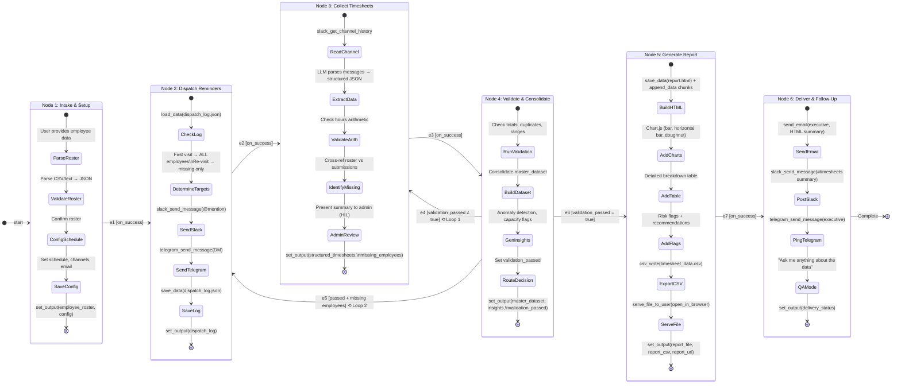

# Timesheet Orchestration Agent — Workflow State Diagram

## Mermaid Diagram

Copy the code block below into [mermaid.live](https://mermaid.live) or any Mermaid renderer to generate the visual diagram.



## Simplified Flow (ASCII)

```
                    ┌─────────────────────────────────────────┐
                    │            HAPPY PATH                    │
                    │                                         │
 START ──► INTAKE ──► DISPATCH ──► COLLECT ──► VALIDATE ──► REPORT ──► DELIVER ──► END
            (HIL)                   (HIL)        │  │  │               (HIL)
                                                 │  │  │
                        FEEDBACK LOOPS           │  │  │
                    ┌────────────────────────────┘  │  │
                    │  Loop 1: Clarification        │  │
                    │  (validation_passed ≠ true)   │  │
                    ▼                               │  │
                  COLLECT ◄─────────────────────────┘  │
                                                       │
                    ┌──────────────────────────────────┘
                    │  Loop 2: Missing Employees
                    │  (passed but missing_employees)
                    ▼
                  DISPATCH ◄───────────────────────────┘
```

## Edge Priority Resolution

When multiple conditional edges leave the VALIDATE node:

```
VALIDATE completes
    │
    ├── Priority 3: e5 → DISPATCH  (if passed AND missing employees)
    │       Evaluated FIRST. If true, takes this path.
    │
    ├── Priority 2: e4 → COLLECT   (if NOT passed)
    │       Evaluated SECOND. If true, takes this path.
    │
    └── Priority 1: e6 → REPORT    (if passed, no issues)
            Evaluated LAST. Default happy path.
```

## Channel Flow Diagram

```
                    AGENT
                   ┌─────┐
                   │     │
          ┌────────┤     ├────────┐
          │        │     │        │
          ▼        │     │        ▼
    ┌──────────┐   │     │  ┌──────────┐
    │  SLACK   │◄──┤     │  │ TELEGRAM │
    │          │───►│     │  │          │
    │ send +   │   │     │  │ send     │
    │ read     │   │     │  │ only     │
    └──────────┘   │     │  └──────────┘
                   │     │
                   │     │        ┌──────────┐
                   │     ├───────►│  EMAIL   │
                   │     │        │ (Resend) │
                   └─────┘        │ send     │
                                  │ only     │
                                  └──────────┘

    Slack:    Reminders (@mention) + Read submissions (channel history)
    Telegram: Push notifications (reminders, escalation, report ping)
    Email:    Executive report delivery (HTML body)
```

## Checkpoint Diagram

```
  INTAKE          DISPATCH        COLLECT         VALIDATE        REPORT          DELIVER
    │                │               │               │              │               │
    ●─── start ──────●─── start ─────●─── start ─────●─── start ───●─── start ─────●─── start
    │                │               │               │              │               │
    ●─── complete ───●─── complete ──●─── complete ──●─── complete ─●─── complete ──●─── complete
    │                │               │               │              │               │
    ▼                ▼               ▼               ▼              ▼               ▼
  [CP1]            [CP2]           [CP3]           [CP4]          [CP5]           [CP6]

    CP = Checkpoint (shared memory snapshot)
    On crash: resume from last clean CP
    On restart: dispatch checks dispatch_log.json for idempotency
```
