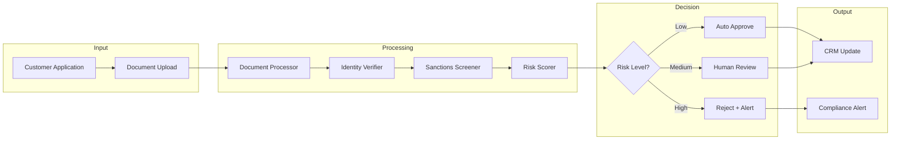
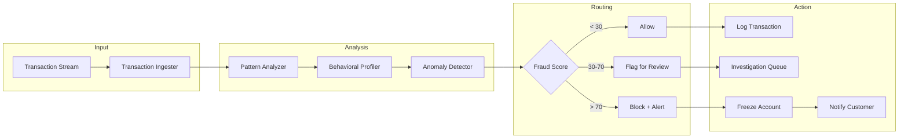
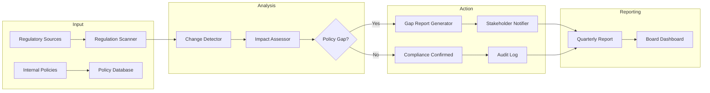

# [Feature]: Fintech Vertical - Compliance, KYC & Fraud Detection Agents

## Overview

Add sample agent implementations for the **Fintech vertical** to enable developers to build compliance automation, KYC verification, fraud detection, and regulatory monitoring agents. This addresses the business process use cases identified in [#2853](https://github.com/adenhq/hive/issues/2853) by expanding beyond sales-focused workflows to financial services automation.

**Target Persona:**
- **Compliance Lead / FinOps Engineer** at a Series A+ fintech startup or mid-size financial institution
- Needs to automate customer onboarding verification, transaction monitoring, and regulatory compliance
- Familiar with Python, API integrations, and compliance workflows

**Market Context:**
- Financial institutions spend **$270B+ annually** on compliance and risk management
- AI can reduce KYC processing time by 80% and false positives in fraud detection by 70%
- 75% of financial services will augment operations with AI by 2026 (Gartner)

---

## Sample Agents

### 1. KYC Verification Agent

**Description:** Automates identity verification, document validation, and PEP/sanctions screening for customer onboarding. Reduces manual review time from days to minutes while maintaining compliance with AML/CFT regulations.

**Business Impact:**
- 80% faster customer onboarding
- 95%+ accuracy in document verification
- Human-in-the-loop for edge cases and high-risk profiles



**Required Tools:**
| Tool | Purpose | Integration Type |
|------|---------|------------------|
| **Onfido/Jumio** | Document verification (passport, ID, selfie matching) | REST API |
| **Sanctions.io/Refinitiv** | PEP/sanctions list screening | REST API |
| **Plaid** | Bank account verification | REST API |
| **HubSpot/CRM** | Customer record updates | ✅ Existing |
| **Email** | Approval/rejection notifications | ✅ Existing |

**Sample Workflow:**
```python
# KYC Verification Agent - Node Structure
nodes = [
    "document_processor",    # Extract data from uploaded ID documents
    "identity_verifier",     # Match selfie to ID photo, validate document authenticity
    "sanctions_screener",    # Check against global PEP/sanctions lists
    "risk_scorer",           # Calculate composite risk score
    "human_review",          # Intervention node for medium/high risk
    "crm_updater",           # Update customer status in CRM
    "notification_sender"    # Send approval/rejection email
]
```

---

### 2. Transaction Monitor Agent

**Description:** Real-time fraud detection system that analyzes transaction patterns, detects anomalies, and routes suspicious activity for investigation. Uses behavioral analytics to reduce false positives while catching sophisticated fraud schemes.

**Business Impact:**
- Real-time fraud detection (milliseconds latency)
- 70% reduction in false positives
- Automatic investigation queue prioritization



**Required Tools:**
| Tool | Purpose | Integration Type |
|------|---------|------------------|
| **Plaid/MX** | Transaction data ingestion | Webhooks + REST API |
| **Segment/Amplitude** | Behavioral analytics | REST API |
| **Slack** | Real-time fraud alerts | Webhook |
| **Twilio** | Customer SMS notifications | REST API |
| **PostgreSQL** | Transaction logging | DB Connection |

**Sample Workflow:**
```python
# Transaction Monitor Agent - Node Structure
nodes = [
    "transaction_ingester",   # Receive transaction webhooks in real-time
    "pattern_analyzer",       # Analyze against historical patterns (time, amount, location)
    "behavioral_profiler",    # Build user behavior profile (typical spend, merchants)
    "anomaly_detector",       # ML-based anomaly detection with explainability
    "alert_router",           # Route based on fraud score thresholds
    "investigation_creator",  # Create case in investigation queue
    "account_freezer",        # Block high-risk transactions
    "customer_notifier"       # SMS/email for blocked transactions
]
```

---

### 3. RegTech Compliance Agent

**Description:** Monitors regulatory changes across jurisdictions, assesses impact on internal policies, and generates audit-ready compliance reports. Proactively alerts compliance teams to required policy updates.

**Business Impact:**
- Continuous regulatory monitoring (vs. manual quarterly reviews)
- Automated compliance report generation
- 50% reduction in compliance team workload



**Required Tools:**
| Tool | Purpose | Integration Type |
|------|---------|------------------|
| **SEC EDGAR/FCA RSS** | Regulatory filing monitoring | RSS/Web Scrape |
| **Notion/Confluence** | Policy documentation | REST API |
| **Slack/Teams** | Stakeholder notifications | Webhook |
| **PDF Generator** | Compliance report generation | ✅ Existing |
| **Web Search** | Regulatory news monitoring | ✅ Existing |

**Sample Workflow:**
```python
# RegTech Compliance Agent - Node Structure
nodes = [
    "regulation_scanner",     # Monitor SEC, FCA, ECB regulatory feeds
    "change_detector",        # Identify new/updated regulations
    "policy_retriever",       # Fetch relevant internal policies
    "impact_assessor",        # Compare regulation to policy (LLM-powered)
    "gap_reporter",           # Generate gap analysis report
    "stakeholder_notifier",   # Alert compliance team + management
    "audit_logger",           # Log all compliance activities
    "report_generator"        # Quarterly board-ready report
]
```

---

## Required Tool Integrations

The following new tool integrations are needed to support Fintech agents:

### 1. Plaid Integration
```markdown
# [Integration]: Plaid - Bank Account & Transaction Data

## Tools
1. **plaid_link_account** - Initiate bank account linking
2. **plaid_get_transactions** - Retrieve transaction history
3. **plaid_verify_identity** - Identity verification via bank data
4. **plaid_get_balance** - Real-time account balance

## Authentication
- **Credentials:** `PLAID_CLIENT_ID`, `PLAID_SECRET`, `PLAID_ENV`
- Production requires Plaid approval

## Cost
| Plan | Price |
|------|-------|
| Free (Sandbox) | $0 |
| Production | $0.30-$1.50/connection/month |
```

### 2. Onfido Integration
```markdown
# [Integration]: Onfido - Identity Document Verification

## Tools
1. **onfido_create_applicant** - Create verification applicant
2. **onfido_upload_document** - Upload ID document for verification
3. **onfido_create_check** - Run verification check
4. **onfido_get_check_result** - Retrieve verification result

## Authentication
- **Credential:** `ONFIDO_API_TOKEN`
- Sandbox available for testing

## Cost
| Check Type | Price |
|------------|-------|
| Document Check | $1-3/check |
| Biometric Check | $3-5/check |
| Full KYC | $5-10/check |
```

### 3. Sanctions Screening Integration
```markdown
# [Integration]: Sanctions.io - PEP/Sanctions Screening

## Tools
1. **sanctions_search_individual** - Screen individual against watchlists
2. **sanctions_search_entity** - Screen organization against watchlists
3. **sanctions_get_lists** - Retrieve available sanction lists
4. **sanctions_monitor_entity** - Set up continuous monitoring

## Authentication
- **Credential:** `SANCTIONS_API_KEY`

## Cost
| Plan | Price |
|------|-------|
| Starter | $99/month (1,000 searches) |
| Growth | $299/month (5,000 searches) |
```

---

## Motion Graphics Video Concept

**Title:** "The KYC Agent in Action"
**Duration:** 45 seconds
**Style:** Flat design with isometric elements, fintech blue/green palette

### Storyboard

| Time | Scene | Visual | Narration/Text |
|------|-------|--------|----------------|
| 0-5s | Problem | Split screen: Left shows compliance officer buried in paper applications, stamping documents | "Traditional KYC takes 3-5 days..." |
| 5-15s | Solution Intro | Hive logo animates in, transforms into a beehive with worker bees (agents) | "Hive's KYC Agent works around the clock" |
| 15-25s | Agent Flow | Animated node graph: Document → Identity Check → Sanctions Screen → Risk Score | Each node lights up as data flows through |
| 25-35s | Human-in-the-Loop | Medium-risk case routes to human reviewer on laptop, shows approve/reject buttons | "Human oversight for complex cases" |
| 35-42s | Results | Dashboard showing: "80% faster", "95% accuracy", "100% audit trail" | Statistics animate in with checkmarks |
| 42-45s | CTA | Hive logo with "Build your compliance agent" | "Start with /building-agents-construction" |

### Visual Assets to Create
- [ ] KYC flow animation (Lottie/Rive)
- [ ] Node graph animation showing data flow
- [ ] Dashboard mockup with compliance metrics
- [ ] Human-in-the-loop interaction animation

---

## Implementation Checklist

### Phase 1: Core Infrastructure
- [ ] Create `fintech_agents/` directory in exports
- [ ] Implement Plaid tool integration
- [ ] Implement Onfido tool integration
- [ ] Implement Sanctions.io tool integration

### Phase 2: Sample Agents
- [ ] Build KYC Verification Agent with tests
- [ ] Build Transaction Monitor Agent with tests
- [ ] Build RegTech Compliance Agent with tests

### Phase 3: Documentation
- [ ] Write README.md with agent descriptions
- [ ] Create motion graphics video
- [ ] Add to main repository examples

---

## Notes

- **Compliance Caveat:** These agents are examples and must be validated against specific regulatory requirements (KYC/AML/CFT) for production use
- **Data Privacy:** Ensure proper data handling for PII in accordance with GDPR, CCPA, and financial privacy regulations
- **Audit Trail:** All agent decisions must be logged for regulatory audit purposes
- **Human-in-the-Loop:** Critical for compliance - high-risk decisions must route to human reviewers

**Parent Issue:** #2853
**Vertical:** Fintech
**Labels:** `enhancement`, `help wanted`, `fintech`, `sample-agents`
