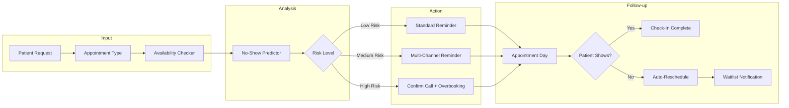
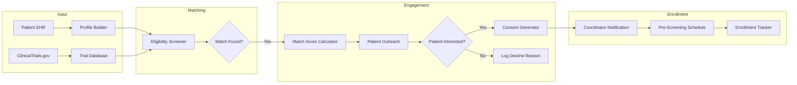
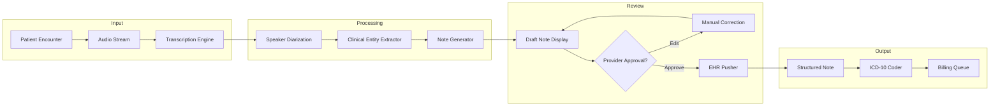

# [Feature]: HealthTech Vertical - Patient Scheduling, Clinical Trials & Medical Records Agents

## Overview

Add sample agent implementations for the **HealthTech vertical** to enable developers to build patient scheduling optimization, clinical trial recruitment, and medical records automation agents. This addresses the business process use cases identified in [#2853](https://github.com/adenhq/hive/issues/2853) by expanding beyond sales-focused workflows to healthcare operations automation.

**Target Persona:**
- **Health IT Director / Digital Health Product Manager** at a hospital, clinic network, or clinical research organization
- Needs to reduce appointment no-shows, accelerate patient recruitment, and automate clinical documentation
- Familiar with healthcare data standards (HL7/FHIR), HIPAA compliance, and EHR systems

**Market Context:**
- Healthcare operations waste **$500B+ annually** on administrative inefficiencies (McKinsey)
- AI-powered scheduling can reduce no-shows by 30%
- Clinical trial recruitment can be accelerated from months to days with AI matching
- Ambient AI scribes save clinicians 2+ hours per day on documentation

---

## Sample Agents

### 1. Smart Scheduler Agent

**Description:** AI-powered patient scheduling system that predicts no-show risk, sends personalized reminders, and auto-reschedules missed appointments. Integrates with EHR calendars and uses patient behavioral patterns to optimize appointment slots.

**Business Impact:**
- 30% reduction in no-shows
- 15% increase in provider utilization
- 24/7 patient self-scheduling via AI chatbot



**Required Tools:**
| Tool | Purpose | Integration Type |
|------|---------|------------------|
| **Epic/Cerner FHIR** | EHR calendar access, patient data | FHIR R4 API |
| **Twilio** | SMS/voice reminders | REST API |
| **Cal.com/Google Calendar** | Scheduling coordination | REST API |
| **Web Scrape** | Provider availability parsing | ✅ Existing |
| **Email** | Appointment confirmations | ✅ Existing |

**Sample Workflow:**
```python
# Smart Scheduler Agent - Node Structure
nodes = [
    "request_parser",        # Parse appointment request (type, urgency, preferences)
    "availability_checker",  # Query EHR for open slots matching criteria
    "noshow_predictor",      # ML model predicting no-show risk based on history
    "slot_optimizer",        # Select optimal slot considering overbooking strategy
    "reminder_scheduler",    # Schedule tiered reminders based on risk
    "confirmation_sender",   # Send confirmation via patient's preferred channel
    "day_of_checker",        # Day-of reminder with check-in instructions
    "noshow_handler",        # Auto-reschedule and notify waitlist
]
```

---

### 2. Clinical Trial Matcher Agent

**Description:** Matches patients to eligible clinical trials by analyzing medical records against trial inclusion/exclusion criteria. Automates patient recruitment that traditionally takes months, reducing it to days.

**Business Impact:**
- 10x faster patient recruitment
- 50% reduction in screen failure rates
- Automated consent document generation



**Required Tools:**
| Tool | Purpose | Integration Type |
|------|---------|------------------|
| **Epic/Cerner FHIR** | Patient medical records | FHIR R4 API |
| **ClinicalTrials.gov API** | Trial eligibility criteria | REST API |
| **Twilio** | Patient outreach (SMS/call) | REST API |
| **DocuSign** | E-consent signatures | REST API |
| **PDF Generator** | Consent document generation | ✅ Existing |

**Sample Workflow:**
```python
# Clinical Trial Matcher Agent - Node Structure
nodes = [
    "patient_profiler",      # Build structured patient profile from EHR
    "trial_fetcher",         # Query ClinicalTrials.gov for active trials
    "eligibility_matcher",   # Compare patient profile to inclusion/exclusion criteria
    "match_scorer",          # Rank trials by match quality
    "patient_outreacher",    # Contact patient with trial information
    "consent_generator",     # Generate personalized consent document
    "coordinator_notifier",  # Alert clinical research coordinator
    "enrollment_tracker",    # Track patient through enrollment funnel
]
```

---

### 3. Ambient Scribe Agent

**Description:** Listens to patient-provider conversations, transcribes in real-time, extracts clinical entities, and generates structured notes that populate EHR fields. Reduces documentation burden and improves note accuracy.

**Business Impact:**
- 2+ hours saved per clinician per day
- 95% reduction in after-hours documentation ("pajama time")
- Improved note completeness and coding accuracy



**Required Tools:**
| Tool | Purpose | Integration Type |
|------|---------|------------------|
| **Whisper/Deepgram** | Medical audio transcription | Streaming API |
| **Epic/Cerner FHIR** | EHR note insertion | FHIR R4 API |
| **spaCy/MedSpaCy** | Clinical NER extraction | Python Library |
| **LLM (Claude/GPT)** | Note generation | ✅ Existing |
| **Web Search** | Drug/procedure lookup | ✅ Existing |

**Sample Workflow:**
```python
# Ambient Scribe Agent - Node Structure
nodes = [
    "audio_streamer",        # Capture audio from room/telehealth
    "transcriber",           # Real-time speech-to-text with medical vocabulary
    "diarizer",              # Identify patient vs. provider speech
    "entity_extractor",      # Extract symptoms, medications, diagnoses, procedures
    "note_generator",        # Create structured SOAP note
    "provider_reviewer",     # Human-in-the-loop for approval
    "ehr_pusher",            # Insert note into EHR
    "coder_suggester",       # Suggest ICD-10/CPT codes
]
```

---

## Required Tool Integrations

The following new tool integrations are needed to support HealthTech agents:

### 1. FHIR Integration (Epic/Cerner)
```markdown
# [Integration]: FHIR R4 - EHR Data Access

## Tools
1. **fhir_get_patient** - Retrieve patient demographics
2. **fhir_get_conditions** - Get patient diagnoses/conditions
3. **fhir_get_medications** - Get active medications
4. **fhir_get_appointments** - Get scheduled appointments
5. **fhir_create_appointment** - Schedule new appointment
6. **fhir_create_document** - Insert clinical document

## Authentication
- **Credentials:** `FHIR_BASE_URL`, `FHIR_CLIENT_ID`, `FHIR_CLIENT_SECRET`
- OAuth 2.0 / SMART on FHIR authentication
- Requires EHR vendor approval for production

## Cost
| Vendor | API Access |
|--------|------------|
| Epic | Via App Orchard (approval required) |
| Cerner | Via CODE program |
| Sandbox | Free for development |
```

### 2. ClinicalTrials.gov Integration
```markdown
# [Integration]: ClinicalTrials.gov - Clinical Trial Data

## Tools
1. **ct_search_trials** - Search trials by condition, location, phase
2. **ct_get_trial** - Get detailed trial information
3. **ct_get_eligibility** - Get inclusion/exclusion criteria
4. **ct_get_locations** - Get trial site locations

## Authentication
- **Credential:** None required (public API)
- Rate limits apply

## Cost
| Plan | Price |
|------|-------|
| API Access | Free |
```

### 3. Twilio Healthcare Integration
```markdown
# [Integration]: Twilio - Patient Communication

## Tools
1. **twilio_send_sms** - Send SMS reminder
2. **twilio_make_call** - Make automated voice call
3. **twilio_send_mms** - Send appointment details with image
4. **twilio_create_conversation** - Start two-way messaging

## Authentication
- **Credentials:** `TWILIO_ACCOUNT_SID`, `TWILIO_AUTH_TOKEN`, `TWILIO_PHONE_NUMBER`

## Cost
| Message Type | Price |
|--------------|-------|
| SMS (US) | $0.0079/message |
| Voice (US) | $0.013/minute |
```

### 4. Medical Transcription Integration
```markdown
# [Integration]: Deepgram/Whisper - Medical Transcription

## Tools
1. **transcribe_audio** - Transcribe audio file
2. **transcribe_stream** - Real-time streaming transcription
3. **transcribe_with_diarization** - Transcribe with speaker labels
4. **get_medical_entities** - Extract clinical entities from transcript

## Authentication
- **Credential:** `DEEPGRAM_API_KEY` or `WHISPER_API_KEY`

## Cost
| Provider | Price |
|----------|-------|
| Deepgram | $0.0043/minute (medical model) |
| Whisper (OpenAI) | $0.006/minute |
| Whisper (self-hosted) | Compute cost only |
```

---

## Motion Graphics Video Concept

**Title:** "Never Miss an Appointment Again"
**Duration:** 45 seconds
**Style:** Friendly healthcare aesthetic, calming blues and greens, diverse patient representations

### Storyboard

| Time | Scene | Visual | Narration/Text |
|------|-------|--------|----------------|
| 0-5s | Problem | Frustrated receptionist on phone, calendar with crossed-out appointments, empty waiting room | "30% of appointments end as no-shows" |
| 5-12s | AI Solution | Hive logo transforms into a friendly healthcare assistant avatar | "Meet the Smart Scheduler Agent" |
| 12-22s | Agent Flow | Patient books online → AI analyzes history → Risk score appears → Tiered reminders sent | Show phone receiving personalized SMS |
| 22-30s | Results | Split screen: Traditional (empty chair) vs. Hive (full waiting room) | "Personalized reminders reduce no-shows by 30%" |
| 30-38s | Clinical Trial | Quick cut to patient profile → Matched to trial → Consent signed on tablet | "Clinical Trial Matcher finds eligible patients in days, not months" |
| 38-42s | Ambient Scribe | Doctor talking to patient, notes auto-populating on screen | "Ambient Scribe drafts notes in real-time" |
| 42-45s | CTA | All three agents shown as cards, Hive logo | "Build healthcare agents that care" |

### Visual Assets to Create
- [ ] Healthcare-friendly agent avatar design
- [ ] Patient phone receiving SMS animation
- [ ] EHR interface mockup with auto-populating notes
- [ ] Calendar showing filled vs. empty slots comparison

---

## Implementation Checklist

### Phase 1: Core Infrastructure
- [ ] Create `healthtech_agents/` directory in exports
- [ ] Implement FHIR R4 tool integration (start with Sandbox)
- [ ] Implement Twilio healthcare tool integration
- [ ] Implement ClinicalTrials.gov tool integration

### Phase 2: Sample Agents
- [ ] Build Smart Scheduler Agent with tests
- [ ] Build Clinical Trial Matcher Agent with tests
- [ ] Build Ambient Scribe Agent with tests

### Phase 3: Documentation
- [ ] Write README.md with agent descriptions
- [ ] Create motion graphics video
- [ ] Add HIPAA compliance notes

---

## Notes

- **HIPAA Compliance:** All agents must be deployed in HIPAA-compliant environments. Ensure BAAs with all vendors.
- **EHR Approval:** FHIR access to production EHRs requires vendor approval (Epic App Orchard, Cerner CODE)
- **Consent:** Patient consent required for clinical trial matching and audio recording
- **PHI Handling:** Never log or store PHI outside of compliant systems
- **Human-in-the-Loop:** Critical for clinical decisions - all AI suggestions must be reviewed by licensed providers

**Parent Issue:** #2853
**Vertical:** HealthTech
**Labels:** `enhancement`, `help wanted`, `healthtech`, `sample-agents`
