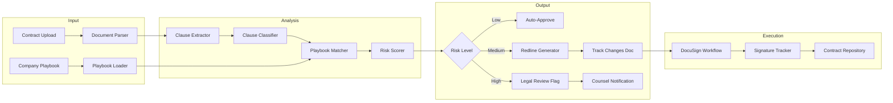
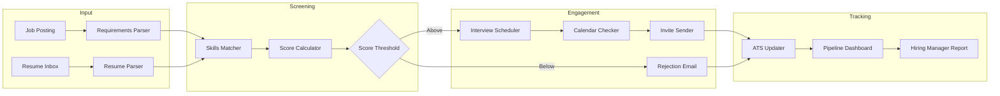
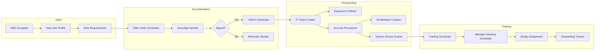

# [Feature]: LegalTech/HRTech Vertical - Contract Review, Recruiting & Onboarding Agents

## Overview

Add sample agent implementations for the **LegalTech/HRTech vertical** to enable developers to build contract review, recruiting automation, and employee onboarding agents. This addresses the business process use cases identified in [#2853](https://github.com/adenhq/hive/issues/2853) by expanding beyond sales-focused workflows to legal and HR operations.

**Target Persona:**
- **General Counsel / HR Director / People Ops Lead** at a fast-growing startup or mid-size company
- Needs to review and redline contracts efficiently, scale recruiting without scaling headcount, and automate onboarding paperwork
- Familiar with legal document workflows, ATS systems, and HRIS platforms

**Market Context:**
- Knowledge workers spend **240+ hours/year** on repetitive document work
- Legal AI market projected to reach $7.4B by 2035 (from $2.1B in 2025)
- 87% of legal professionals expect AI to enhance contract review
- AI can reduce contract review time by 90% while improving accuracy

---

## Sample Agents

### 1. Contract Review Agent

**Description:** AI-powered contract analysis that extracts key clauses, compares against company playbook, identifies risks, and generates redline suggestions. Enables junior associates and business teams to review contracts with senior-level quality.

**Business Impact:**
- 90% faster contract review
- Consistent application of playbook terms
- Risk flagging before signature



**Required Tools:**
| Tool | Purpose | Integration Type |
|------|---------|------------------|
| **PDF Reader** | Contract document parsing | ✅ Existing |
| **LLM (Claude)** | Clause extraction and analysis | ✅ Existing |
| **DocuSign** | E-signature workflow | REST API |
| **Notion/Confluence** | Playbook storage | REST API |
| **Email** | Stakeholder notifications | ✅ Existing |

**Sample Workflow:**
```python
# Contract Review Agent - Node Structure
nodes = [
    "document_parser",       # Extract text from PDF/DOCX contracts
    "clause_extractor",      # Identify individual clauses using NLP
    "clause_classifier",     # Classify clauses (indemnity, liability, IP, etc.)
    "playbook_matcher",      # Compare clauses to company-approved language
    "deviation_detector",    # Identify deviations from playbook
    "risk_scorer",           # Calculate overall contract risk score
    "redline_generator",     # Generate suggested edits in track changes
    "legal_router",          # Route high-risk to counsel, low-risk to auto-approve
    "docusign_sender",       # Send for e-signature when approved
    "contract_archiver",     # Store executed contract in repository
]
```

---

### 2. Talent Screener Agent

**Description:** AI-powered resume screening that parses applications, matches skills to job requirements, reduces bias, and auto-schedules interviews with qualified candidates. Enables recruiting teams to process 10x more applicants without increasing headcount.

**Business Impact:**
- 10x more applicants processed
- 50% reduction in time-to-hire
- Bias reduction through structured evaluation



**Required Tools:**
| Tool | Purpose | Integration Type |
|------|---------|------------------|
| **Lever/Greenhouse** | ATS integration | REST API |
| **Cal.com/Calendly** | Interview scheduling | REST API |
| **LinkedIn** | Candidate sourcing | REST API |
| **PDF Reader** | Resume parsing | ✅ Existing |
| **Email** | Candidate communications | ✅ Existing |

**Sample Workflow:**
```python
# Talent Screener Agent - Node Structure
nodes = [
    "job_parser",            # Extract requirements from job description
    "resume_ingester",       # Import resumes from ATS/email
    "resume_parser",         # Extract structured data from resume
    "skills_matcher",        # Match candidate skills to requirements
    "experience_validator",  # Validate experience claims
    "bias_checker",          # Remove bias signals from evaluation
    "score_calculator",      # Calculate fit score (0-100)
    "threshold_router",      # Route based on score
    "interview_scheduler",   # Auto-schedule with hiring manager
    "ats_updater",           # Update candidate status in ATS
    "candidate_notifier",    # Send status updates to candidates
]
```

---

### 3. Onboarding Orchestrator Agent

**Description:** End-to-end new hire onboarding automation that generates offer letters, provisions system access, schedules training, and tracks completion. Ensures consistent onboarding experience regardless of team or location.

**Business Impact:**
- 100% paperless onboarding
- 80% reduction in HR admin time
- Day-1 productivity for new hires



**Required Tools:**
| Tool | Purpose | Integration Type |
|------|---------|------------------|
| **BambooHR/Workday** | HRIS integration | REST API |
| **DocuSign** | Document e-signatures | REST API |
| **Okta/Azure AD** | Identity provisioning | REST API/SCIM |
| **Jira/ServiceNow** | IT ticket creation | REST API |
| **Slack** | Workspace onboarding | REST API |
| **Google Workspace** | Email/calendar setup | REST API |

**Sample Workflow:**
```python
# Onboarding Orchestrator Agent - Node Structure
nodes = [
    "offer_processor",       # Process signed offer acceptance
    "document_generator",    # Generate offer letter, NDA, I-9, W-4
    "signature_collector",   # Send for e-signature via DocuSign
    "hris_creator",          # Create employee record in HRIS
    "it_ticket_creator",     # Create provisioning tickets
    "account_provisioner",   # Create email, Slack, other accounts
    "access_granter",        # Grant role-based system access
    "equipment_orderer",     # Order laptop, peripherals
    "training_scheduler",    # Schedule required training
    "buddy_assigner",        # Assign onboarding buddy
    "manager_notifier",      # Send prep checklist to manager
    "progress_tracker",      # Track onboarding completion
]
```

---

## Required Tool Integrations

The following new tool integrations are needed to support LegalTech/HRTech agents:

### 1. DocuSign Integration
```markdown
# [Integration]: DocuSign - E-Signature Workflow

## Tools
1. **docusign_create_envelope** - Create signature envelope
2. **docusign_add_document** - Add document to envelope
3. **docusign_add_recipient** - Add signer/CC recipients
4. **docusign_send_envelope** - Send for signature
5. **docusign_get_envelope_status** - Check signature status
6. **docusign_download_document** - Download signed document

## Authentication
- **Credentials:** `DOCUSIGN_INTEGRATION_KEY`, `DOCUSIGN_SECRET_KEY`, `DOCUSIGN_ACCOUNT_ID`
- OAuth 2.0 authentication
- Sandbox available for testing

## Cost
| Plan | Price |
|------|-------|
| Personal | $10/month (5 envelopes) |
| Standard | $25/user/month |
| Business Pro | $40/user/month |
| API | $50/month + per-envelope |
```

### 2. Lever/Greenhouse ATS Integration
```markdown
# [Integration]: Lever - Applicant Tracking System

## Tools
1. **lever_list_postings** - Get active job postings
2. **lever_list_candidates** - Get candidates for a posting
3. **lever_get_candidate** - Get candidate details
4. **lever_add_candidate** - Add new candidate
5. **lever_update_stage** - Move candidate through pipeline
6. **lever_add_note** - Add note to candidate profile
7. **lever_schedule_interview** - Create interview event

## Authentication
- **Credential:** `LEVER_API_KEY`

## Cost
| Plan | Price |
|------|-------|
| LeverTRM Basic | Custom pricing |
| LeverTRM Pro | Custom pricing |
| API Access | Included with subscription |
```

### 3. BambooHR Integration
```markdown
# [Integration]: BambooHR - HRIS System

## Tools
1. **bamboo_create_employee** - Create new employee record
2. **bamboo_get_employee** - Get employee details
3. **bamboo_update_employee** - Update employee information
4. **bamboo_get_time_off** - Get time off requests
5. **bamboo_get_directory** - Get company directory
6. **bamboo_request_signature** - Request e-signature on document

## Authentication
- **Credentials:** `BAMBOOHR_SUBDOMAIN`, `BAMBOOHR_API_KEY`

## Cost
| Plan | Price |
|------|-------|
| Core | ~$5/employee/month |
| Pro | ~$8/employee/month |
| API Access | Included |
```

### 4. Okta/Azure AD Integration
```markdown
# [Integration]: Okta - Identity & Access Management

## Tools
1. **okta_create_user** - Create new user account
2. **okta_assign_apps** - Assign applications to user
3. **okta_assign_groups** - Add user to groups
4. **okta_deactivate_user** - Deactivate user account
5. **okta_reset_password** - Send password reset
6. **okta_get_user** - Get user details

## Authentication
- **Credentials:** `OKTA_DOMAIN`, `OKTA_API_TOKEN`
- SCIM 2.0 supported for automated provisioning

## Cost
| Plan | Price |
|------|-------|
| Workforce Identity | $2-6/user/month |
| API Access | Included |
```

---

## Motion Graphics Video Concept

**Title:** "From Inbox Zero to Hired"
**Duration:** 45 seconds
**Style:** Professional corporate aesthetic, purple/teal palette, paper-to-digital transformations

### Storyboard

| Time | Scene | Visual | Narration/Text |
|------|-------|--------|----------------|
| 0-5s | Problem | HR manager drowning in paper resumes, contracts piled on desk, clock spinning | "Knowledge workers waste 240 hours/year on document chaos" |
| 5-12s | AI Solution | Papers animate into digital streams flowing into Hive logo | "Hive agents automate the boring stuff" |
| 12-20s | Contract Review | Contract PDF animates: clauses highlight → compare to playbook → risk flags appear → redlines generate | "Contract Review: 90% faster with AI-assisted redlining" |
| 20-28s | Talent Screener | Resume stack → AI scans → Skills match checkmarks → Calendar integration → Interview scheduled | "Screen 10x candidates, schedule interviews automatically" |
| 28-38s | Onboarding | New hire accepts offer → Documents sign themselves → Laptop ships → Systems provision → Day 1 ready | "Paperless onboarding: new hires productive from day one" |
| 38-42s | Integration | Logos of DocuSign, Lever, BambooHR, Okta floating connected | "Works with your existing tools" |
| 42-45s | CTA | Happy diverse team onscreen, Hive logo | "Build HR agents that scale with you" |

### Visual Assets to Create
- [ ] Paper-to-digital transformation animation
- [ ] Contract with animated clause highlighting
- [ ] Resume screening flow animation
- [ ] System provisioning checklist animation

---

## Implementation Checklist

### Phase 1: Core Infrastructure
- [ ] Create `legaltech_hrtech_agents/` directory in exports
- [ ] Implement DocuSign tool integration
- [ ] Implement Lever/Greenhouse tool integration (extend existing)
- [ ] Implement BambooHR tool integration
- [ ] Implement Okta tool integration

### Phase 2: Sample Agents
- [ ] Build Contract Review Agent with tests
- [ ] Build Talent Screener Agent with tests
- [ ] Build Onboarding Orchestrator Agent with tests

### Phase 3: Documentation
- [ ] Write README.md with agent descriptions
- [ ] Create motion graphics video
- [ ] Add compliance notes (SOC 2, GDPR)

---

## Notes

- **Legal Disclaimer:** Contract Review Agent provides suggestions only; final review by qualified attorney recommended
- **Bias Auditing:** Talent Screener must be regularly audited for algorithmic bias (EEOC compliance)
- **Data Privacy:** HR data subject to GDPR, CCPA; ensure compliant data handling
- **SOC 2:** When processing HR/legal data, prefer SOC 2 compliant integrations
- **Human-in-the-Loop:** Critical for legal decisions - all contract risks must be reviewable by counsel
- **Playbook Maintenance:** Contract playbook should be updated quarterly by legal team

**Parent Issue:** #2853
**Vertical:** LegalTech/HRTech
**Labels:** `enhancement`, `help wanted`, `legaltech`, `hrtech`, `sample-agents`
