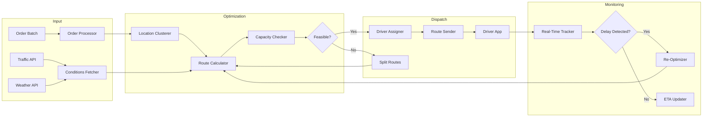
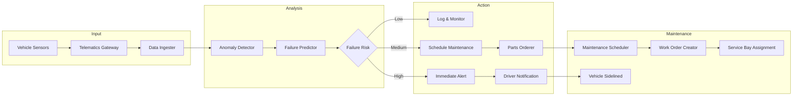
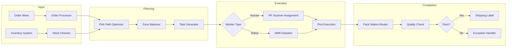

# [Feature]: Logistics Vertical - Route Optimization, Fleet Management & Warehouse Agents

## Overview

Add sample agent implementations for the **Logistics vertical** to enable developers to build route optimization, fleet management, and warehouse automation agents. This addresses the business process use cases identified in [#2853](https://github.com/adenhq/hive/issues/2853) by expanding beyond sales-focused workflows to supply chain and logistics operations.

**Target Persona:**
- **Operations Manager / Supply Chain Engineer** at a 3PL, e-commerce fulfillment center, or transportation company
- Needs to optimize delivery routes, predict maintenance needs, and automate warehouse operations
- Familiar with logistics software, fleet telematics, and warehouse management systems

**Market Context:**
- Logistics operations face **$1.5 trillion** in annual inefficiencies globally
- AI-powered route optimization delivers 15-40% fuel savings
- Predictive maintenance reduces fleet breakdowns by 30% (UPS case study)
- Warehouse AI can increase order processing speed by 50%

---

## Sample Agents

### 1. Route Optimizer Agent

**Description:** Dynamic routing system that calculates optimal delivery routes considering real-time traffic, weather conditions, delivery windows, and vehicle capacity. Continuously re-optimizes throughout the day as conditions change.

**Business Impact:**
- 20% reduction in fuel costs
- 15% increase in deliveries per driver
- Zero manual dispatch work



**Required Tools:**
| Tool | Purpose | Integration Type |
|------|---------|------------------|
| **Google Maps Platform** | Routing, geocoding, traffic | REST API |
| **OpenWeather** | Weather conditions | REST API |
| **Samsara/Geotab** | Vehicle telematics | REST API + Webhooks |
| **Twilio** | Driver SMS notifications | REST API |
| **CSV** | Order batch import | ✅ Existing |

**Sample Workflow:**
```python
# Route Optimizer Agent - Node Structure
nodes = [
    "order_ingester",        # Import orders from WMS/OMS
    "geocoder",              # Convert addresses to coordinates
    "location_clusterer",    # Group nearby deliveries
    "traffic_fetcher",       # Get real-time traffic data
    "weather_checker",       # Check weather impact on routes
    "route_calculator",      # Run optimization algorithm (ORION-style)
    "capacity_validator",    # Ensure vehicle capacity constraints
    "driver_assigner",       # Match routes to available drivers
    "route_dispatcher",      # Send routes to driver mobile app
    "eta_monitor",           # Track progress and update ETAs
]
```

---

### 2. Predictive Maintenance Agent

**Description:** Monitors fleet vehicle health using IoT sensor data, predicts potential failures before they occur, and automatically schedules maintenance. Reduces unplanned breakdowns and extends vehicle lifespan.

**Business Impact:**
- 30% reduction in unplanned breakdowns
- 20% extension of vehicle lifespan
- Optimized parts inventory (JIT ordering)



**Required Tools:**
| Tool | Purpose | Integration Type |
|------|---------|------------------|
| **Samsara/Geotab** | Vehicle telematics data | REST API + Webhooks |
| **PostgreSQL/TimescaleDB** | Time-series sensor storage | DB Connection |
| **Slack** | Maintenance alerts | Webhook |
| **Email** | Work order notifications | ✅ Existing |
| **Web Search** | Parts availability lookup | ✅ Existing |

**Sample Workflow:**
```python
# Predictive Maintenance Agent - Node Structure
nodes = [
    "telematics_receiver",   # Receive vehicle sensor data streams
    "data_normalizer",       # Standardize sensor readings
    "anomaly_detector",      # Detect abnormal patterns (vibration, temp, pressure)
    "failure_predictor",     # ML model predicting component failure
    "risk_classifier",       # Classify urgency (low/medium/high)
    "maintenance_scheduler", # Find optimal maintenance window
    "parts_checker",         # Check parts inventory/availability
    "parts_orderer",         # Auto-order needed parts
    "work_order_creator",    # Create maintenance work order
    "fleet_notifier",        # Alert fleet manager and driver
]
```

---

### 3. Warehouse Orchestrator Agent

**Description:** Real-time warehouse operations coordinator that optimizes picking paths, assigns tasks to workers/robots, and manages inventory movements. Adapts to changing conditions and priorities throughout the shift.

**Business Impact:**
- 50% faster order processing
- 40% reduction in picking errors
- Dynamic labor allocation



**Required Tools:**
| Tool | Purpose | Integration Type |
|------|---------|------------------|
| **SAP/Oracle WMS** | Warehouse management system | REST API |
| **Locus/6 River** | AMR robot coordination | REST API |
| **ShipStation/EasyPost** | Shipping label generation | REST API |
| **Zebra** | Label printing | Local API |
| **CSV** | Order import/export | ✅ Existing |

**Sample Workflow:**
```python
# Warehouse Orchestrator Agent - Node Structure
nodes = [
    "order_receiver",        # Receive order wave from OMS
    "inventory_checker",     # Verify stock availability by location
    "pick_path_optimizer",   # Calculate shortest path through warehouse
    "zone_balancer",         # Balance workload across zones
    "task_assigner",         # Assign tasks to workers/robots
    "progress_monitor",      # Track pick/pack progress in real-time
    "exception_handler",     # Handle stockouts, damages, shorts
    "pack_router",           # Route to appropriate pack station
    "label_generator",       # Generate shipping labels
    "dispatch_planner",      # Group by carrier/route for shipping
]
```

---

## Required Tool Integrations

The following new tool integrations are needed to support Logistics agents:

### 1. Google Maps Platform Integration
```markdown
# [Integration]: Google Maps Platform - Routing & Geolocation

## Tools
1. **maps_geocode** - Convert address to coordinates
2. **maps_reverse_geocode** - Convert coordinates to address
3. **maps_directions** - Get route between points
4. **maps_distance_matrix** - Calculate distances for multiple origins/destinations
5. **maps_traffic** - Get real-time traffic conditions
6. **maps_optimize_route** - Optimize multi-stop route (TSP solver)

## Authentication
- **Credential:** `GOOGLE_MAPS_API_KEY`
- Enable: Geocoding, Directions, Distance Matrix, Routes APIs

## Cost
| API | Price |
|-----|-------|
| Geocoding | $5/1,000 requests |
| Directions | $5-10/1,000 requests |
| Distance Matrix | $5-10/1,000 elements |
| Route Optimization | $10/1,000 requests |
```

### 2. Samsara Integration
```markdown
# [Integration]: Samsara - Fleet Telematics

## Tools
1. **samsara_list_vehicles** - Get all fleet vehicles
2. **samsara_get_vehicle_stats** - Get vehicle health metrics
3. **samsara_get_location** - Get real-time vehicle location
4. **samsara_get_driver_safety** - Get driver safety scores
5. **samsara_get_fuel_usage** - Get fuel consumption data
6. **samsara_get_alerts** - Get vehicle/driver alerts

## Authentication
- **Credential:** `SAMSARA_API_TOKEN`
- Webhook support for real-time events

## Cost
| Plan | Price |
|------|-------|
| Complete | Custom pricing per vehicle |
| API Access | Included with subscription |
```

### 3. ShipStation Integration
```markdown
# [Integration]: ShipStation - Shipping Labels

## Tools
1. **shipstation_create_order** - Create shipping order
2. **shipstation_get_rates** - Get carrier rates
3. **shipstation_create_label** - Generate shipping label
4. **shipstation_track_shipment** - Get tracking updates
5. **shipstation_void_label** - Cancel/void label

## Authentication
- **Credential:** `SHIPSTATION_API_KEY`, `SHIPSTATION_API_SECRET`

## Cost
| Plan | Price |
|------|-------|
| Starter | $9.99/month (50 shipments) |
| Bronze | $29.99/month (500 shipments) |
| Gold | $99.99/month (2,000 shipments) |
```

### 4. Weather API Integration
```markdown
# [Integration]: OpenWeather - Weather Conditions

## Tools
1. **weather_current** - Get current weather for location
2. **weather_forecast** - Get weather forecast (5-day/hourly)
3. **weather_alerts** - Get severe weather alerts
4. **weather_historical** - Get historical weather data

## Authentication
- **Credential:** `OPENWEATHER_API_KEY`

## Cost
| Plan | Price |
|------|-------|
| Free | 1,000 calls/day |
| Startup | $40/month (10,000 calls/day) |
```

---

## Motion Graphics Video Concept

**Title:** "The Invisible Dispatcher"
**Duration:** 45 seconds
**Style:** Industrial aesthetic, orange/blue logistics colors, map-centric visuals

### Storyboard

| Time | Scene | Visual | Narration/Text |
|------|-------|--------|----------------|
| 0-5s | Problem | Overhead view of chaotic dispatch office, multiple whiteboards with routes, phones ringing | "Traditional dispatch: chaos, delays, wasted fuel" |
| 5-12s | AI Solution | Whiteboards fade, replaced by clean digital map with Hive logo | "Meet the Route Optimizer Agent" |
| 12-22s | Agent Flow | Animated map: Orders cluster → Routes calculate → Traffic overlay → Optimal paths emerge | Dots flow along optimal routes, avoiding red traffic zones |
| 22-30s | Split Comparison | Two delivery trucks side by side: Manual (stuck in traffic, red) vs AI (moving, green) | "AI routes save 20% on fuel" |
| 30-38s | Fleet Health | Quick cut to vehicle dashboard, sensor data flowing, maintenance scheduled automatically | "Predictive Maintenance prevents breakdowns" |
| 38-42s | Warehouse | Bird's eye view of warehouse, pick paths lighting up, robots and workers in sync | "Warehouse Orchestrator: 50% faster fulfillment" |
| 42-45s | CTA | Map zooms out showing global logistics network, Hive logo | "Build logistics agents that deliver" |

### Visual Assets to Create
- [ ] Animated map with route optimization visualization
- [ ] Vehicle sensor data dashboard mockup
- [ ] Warehouse pick path animation
- [ ] Split-screen route comparison (manual vs AI)

---

## Implementation Checklist

### Phase 1: Core Infrastructure
- [ ] Create `logistics_agents/` directory in exports
- [ ] Implement Google Maps Platform tool integration
- [ ] Implement Samsara/Geotab tool integration
- [ ] Implement ShipStation tool integration
- [ ] Implement OpenWeather tool integration

### Phase 2: Sample Agents
- [ ] Build Route Optimizer Agent with tests
- [ ] Build Predictive Maintenance Agent with tests
- [ ] Build Warehouse Orchestrator Agent with tests

### Phase 3: Documentation
- [ ] Write README.md with agent descriptions
- [ ] Create motion graphics video
- [ ] Add performance benchmarks

---

## Notes

- **Vehicle Data Privacy:** Ensure driver consent for location tracking in compliance with local regulations
- **API Rate Limits:** Google Maps has rate limits; implement caching for frequently-accessed routes
- **Multi-Stop Optimization:** For complex routes (10+ stops), consider hybrid approach with OR-Tools locally
- **Real-Time Updates:** Use webhooks where available (Samsara) vs. polling for better performance
- **Cold Chain:** For temperature-sensitive shipments, add temperature monitoring nodes

**Parent Issue:** #2853
**Vertical:** Logistics
**Labels:** `enhancement`, `help wanted`, `logistics`, `sample-agents`
